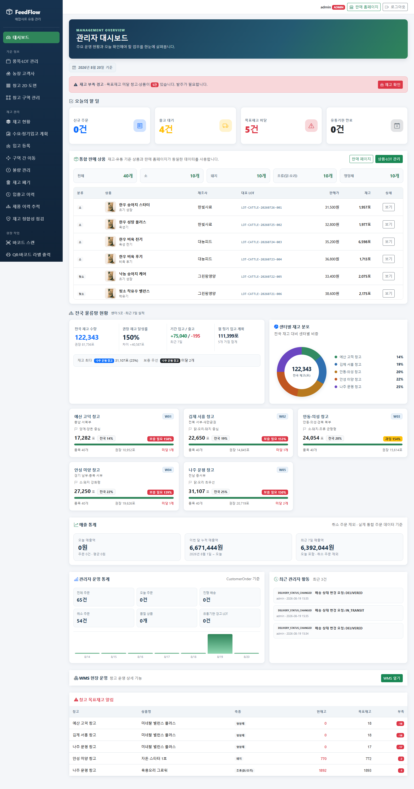
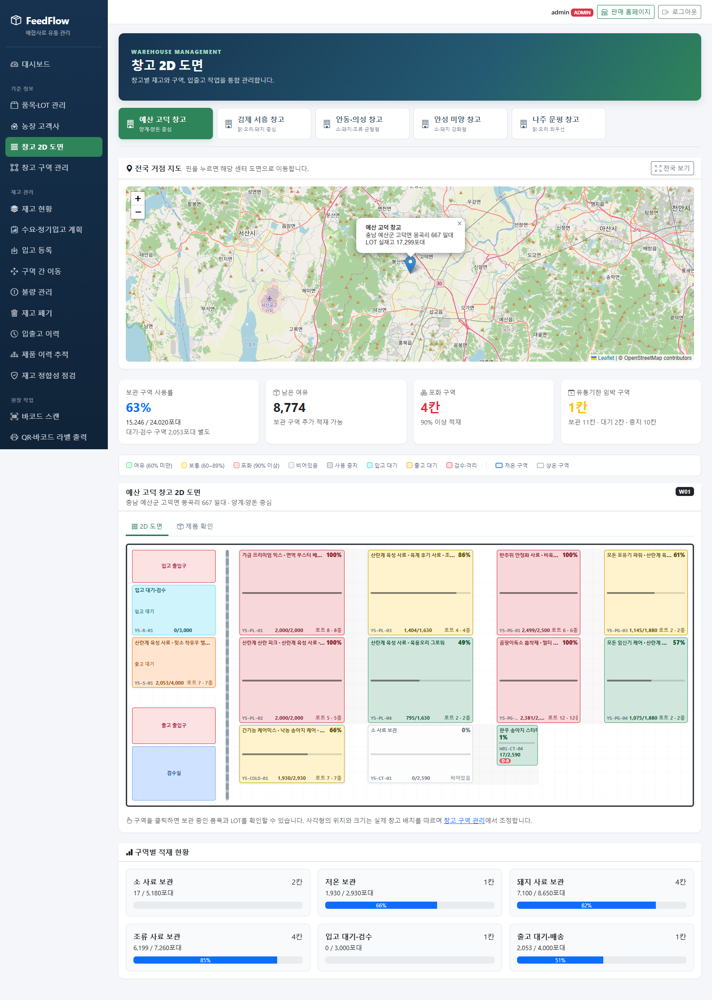
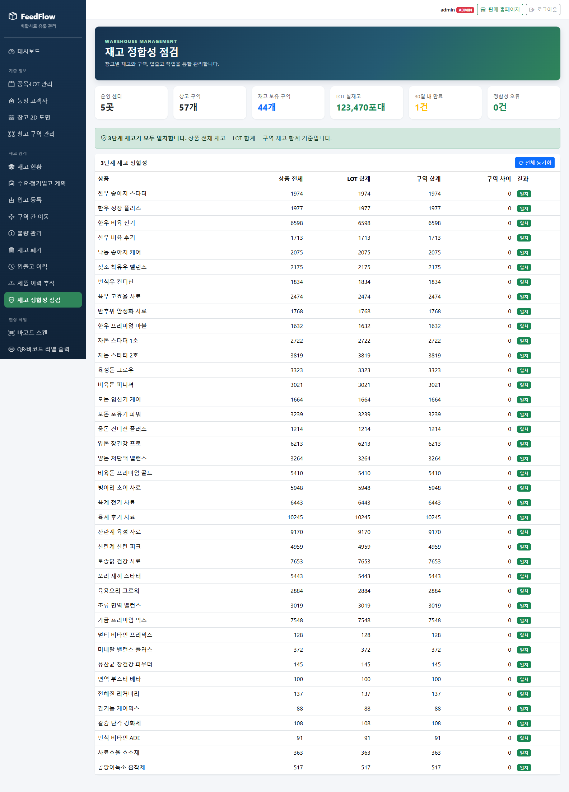

# FeedFlow – 배합사료 유통 관리 플랫폼 (관리자 창고 관리 시스템)

농가가 주문한 사료를 전국 5개 물류 창고에서 **유통기한이 빠른 묶음(LOT)부터** 골라 출고하는
B2B 사료 유통 서비스의 **관리자 창고 관리 시스템(WMS)** 입니다.

> 이 저장소는 제가 맡은 관리자 WMS 모듈입니다.
> 고객 상점 · 주문 · 결제까지 합친 팀 통합본은 [byeongrae-kim/Final-Project](https://github.com/byeongrae-kim/Final-Project) 에 있습니다.

| 항목 | 내용 |
|---|---|
| 기간 | 2026.07.23 ~ 2026.08.28 (5주) |
| 인원 | 3명 – 김병래(팀장, 통합 운영 · 로트 · 수요 예측), 이광일(상품 · 회원 · 주문 · 결제 · 고객 화면), 이용우(관리자 WMS) |
| 내 역할 | 관리자 창고 관리: 입고, 유통기한 순 출고, 창고 도면 · 전국 지도, 창고 간 이동, 재고 점검, 이력 추적, 바코드 · QR |
| 기술 | Java 21, Spring Boot 3.5, Spring Data JPA, Spring Security, Thymeleaf, Bootstrap 5, Chart.js, Leaflet, H2 |

## 왜 만들었나

- 사료는 유통기한이 짧아서, 오래된 재고를 먼저 내보내지 않으면 버리는 사료가 생깁니다.
- 창고에 재고가 있어도 **검사 전이거나 다른 창고로 옮기는 중이면** 바로 팔 수 없습니다.

그래서 "재고가 몇 개인가"가 아니라 **어느 묶음이 어느 칸에 얼마나 있고 언제 만료되는지**를
항상 알 수 있게 만들었습니다.

## 화면

> 최종 발표 때 팀 통합본에서 찍은 화면입니다. 이 저장소는 통합 전 WMS 모듈이라 메뉴와 일부 카드가 조금 다릅니다.

**관리자 대시보드** – 오늘 할 일, 안전재고 · 유통기한 경보, 전국 5개 창고의 재고와 적재율. 매출 통계는 책임자에게만 보입니다.



**창고 2D 도면** – 전국 지도에서 창고를 고르면 칸 배치가 나오고, 칸마다 얼마나 찼는지 색으로 보여 줍니다.



**재고 점검** – 품목 장부, 묶음별 수량 합계, 칸별 수량 합계 세 숫자가 서로 맞는지 대조합니다.



## 만든 기능

| 기능 | 설명 | 주소 |
|---|---|---|
| 입고 | 묶음(LOT) 번호와 유통기한을 기록하고 창고 칸에 넣습니다. 칸 용량을 넘으면 막습니다 | `/admin/inventory/inbound` |
| 유통기한 순 출고 (FEFO) | 주문이 오면 유통기한이 빠른 묶음부터 자동으로 배정합니다. 미리보기 후 처리하고, 취소하면 재고를 원래대로 되돌립니다 | `/admin/outbound` |
| 창고 도면 · 전국 지도 | 칸 배치와 적재율을 그리고, 지도 핀을 누르면 그 창고 도면으로 이동합니다 | `/admin/warehouse-map` |
| 창고 간 이동 | 같은 창고 안 이동과 다른 창고로 옮기는 이관을 구분해 처리합니다 | `/admin/inventory/move` |
| 재고 점검 | 세 숫자(품목 장부 · 묶음 합계 · 칸 합계)를 대조하고, 어긋나면 보정합니다 | `/admin/inventory/sync` |
| 이력 추적 | 묶음 번호로 입고부터 출고 · 폐기까지 타임라인을 봅니다 | `/admin/traceability` |
| 바코드 · QR | 스캔으로 입출고하고 QR 라벨을 출력합니다 | `/admin/scan` |
| 권한 분리 | 책임자(ADMIN)와 사원(STAFF)이 볼 수 있는 화면과 기능을 나눕니다 | `/admin/employees` |
| 농장 · 수요 · 불량 | 팀원 모듈을 옮겨 와 담당 농장, 축종별 수요 계획, 불량 관리를 붙였습니다 | `/admin/farm-customers` 등 |

## 재고를 맞게 유지하는 규칙

모든 기능은 아래 세 숫자가 **항상 같도록** 만들었습니다.

```
품목 장부의 재고  =  묶음(LOT)별 수량의 합  =  창고 칸에 실제로 있는 수량의 합
```

## 해결한 문제

**① 검사 전 사료가 출고될 수 있던 문제**
출고할 재고를 고르는 쿼리가 칸의 용도를 보지 않아, 검사 전 사료나 옮기는 중인 사료도 출고 후보에 들어갔습니다.
'보관 칸과 출고 대기 칸만' 조건을 쿼리에 넣고, 같은 규칙을 쓰는 출고 미리보기도 함께 고쳤습니다.
테스트(`AllocatableStockRepositoryTest`)에서는 칸 다섯 종류에 같은 사료를 나눠 넣고(모두 345포)
보관 · 출고 대기 칸의 155포만 출고 후보로 나오는지 확인했습니다.
앱을 실제로 실행했을 때도 전체 720포인 품목에서 입고 대기 칸의 120포는 출고되지 않았고,
그 120포를 보관 칸으로 옮기자 720포 모두 출고할 수 있었습니다.

**② 화면마다 다르게 보일 수 있던 적재율**
창고별 적재율의 분자는 전체 재고, 분모는 보관 칸 용량이라 기준이 섞여 있었습니다.
계산을 함수 하나(`usageRate`)로 모아 '보관 칸 재고 ÷ 보관 칸 용량'으로 통일하고,
헷갈리던 변수 이름 `s`, `ss` 를 `totalStock`, `storageStock` 으로 바꿨습니다.

**③ 다른 창고로 옮기는 중인 재고는 어디에 있는가**
출발 창고에서 빼고 도착 창고에 넣기 전까지 재고가 어디에도 없으면 세 숫자가 어긋납니다.
점검 로직에 예외를 넣는 대신, 출발 창고 소속의 '운송 중' 가상 칸(`IN_TRANSIT`)을 거쳐 옮기게 해서
옮기는 동안에도 세 숫자가 맞도록 했습니다.

더 자세한 과정은 [회고](docs/retrospective.md)에 적었습니다.

## 실행 방법

DB 설치나 API 키 발급 없이 바로 실행됩니다. (H2 인메모리 DB와 `data.sql` 예시 데이터가 자동으로 올라옵니다)

```bash
cd feedflow
./gradlew bootRun        # Windows: gradlew.bat bootRun
```

`http://localhost:8080` 에 접속한 뒤 아래 계정으로 로그인합니다.

| 계정 | 비밀번호 | 권한 |
|---|---|---|
| `admin@feedflow.co.kr` | `admin123` | 책임자(ADMIN) – 매출, 사원 관리, 폐기, 출고 취소까지 |
| `staff@feedflow.co.kr` | `staff123` | 사원(STAFF) – 재고, 입출고, 도면 |

## 테스트

```bash
cd feedflow
./gradlew test
```

- 24개 테스트 클래스, 315개 테스트 (2026.07.31 로컬 빌드에서 모두 통과)
- 업무 규칙은 Mockito로 빠르게 확인하고, 쿼리 안에만 있는 조건(출고 가능 칸, 적재율 등)은
  `@DataJpaTest` 로 실제 H2 DB에 데이터를 넣어 확인합니다.

## 더 자세한 문서

| 문서 | 내용 |
|---|---|
| [설계 상세](docs/design-details.md) | 단일 창고에서 전국 5개 창고로 넓힌 과정과 설계 판단 |
| [회고](docs/retrospective.md) | 막혔던 문제와 해결 과정, 반복한 실수 |
| [요구사항](docs/requirements.md) | 필수 · 권장 · 선택 기능과 만들지 않은 것 |
| [ERD](docs/erd.md) | 테이블 구조와 재고 3단계 구조 |
| [통합 메모](INTEGRATION-NOTES.md) | 팀원 모듈과 합치기 전에 정한 것들 |
