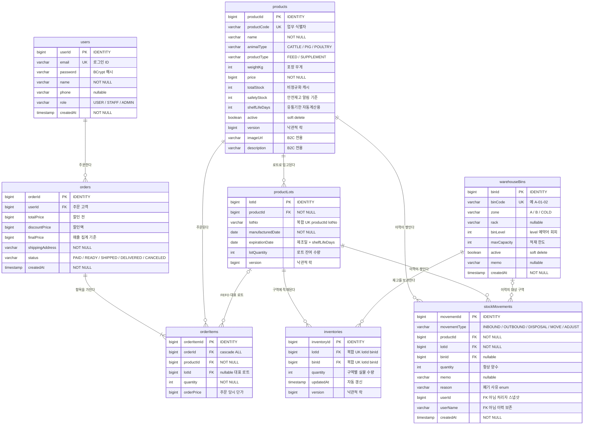
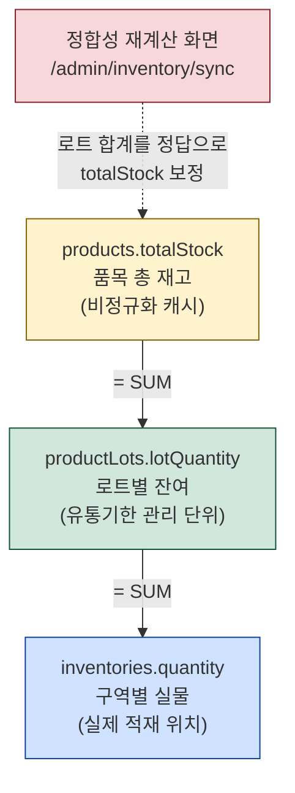
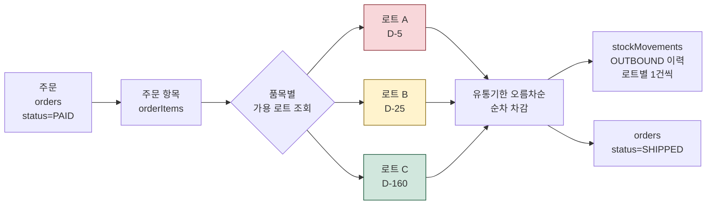
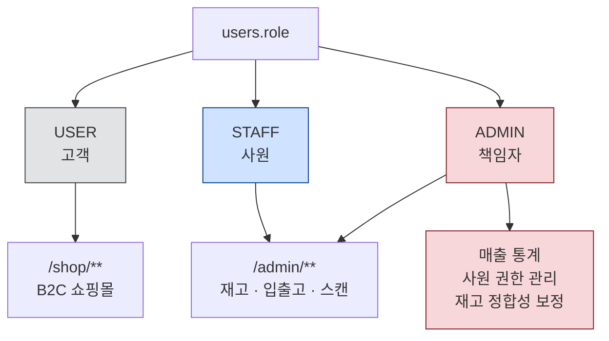

# FeedFlow ERD

배합사료 유통 관리 플랫폼 데이터 모델. B2C 쇼핑몰과 WMS(관리자 창고 시스템)가 하나의 DB를 공유한다.

- 테이블 8개 / 컬럼 68개 / 관계 10건
- 물리 명명 규칙: `PhysicalNamingStrategyStandardImpl` 적용 → **DB 컬럼도 camelCase 유지**
- 예약어 회피를 위해 `users`, `orders`, `binLevel` 만 이름을 변경

상세 정의서는 [erd-columns.tsv](erd-columns.tsv) · [erd-relations.tsv](erd-relations.tsv) · [erd-enums.tsv](erd-enums.tsv) 참고.

## 전체 ERD

## 재고가 3단으로 관리되는 구조

재고 수량은 조회 성능을 위해 세 계층에 중복 저장된다. 세 값은 항상 같아야 한다.

세 계층은 입고 · 출고 · 폐기 시 **한 트랜잭션에서 함께 갱신**되고, `products` · `productLots` · `inventories` 세 엔티티에 `@Version` 낙관적 락이 걸려 있다.

## FEFO 출고 흐름

유통기한이 가장 빠른 로트부터 차감한다.

한 주문 항목이 여러 로트에 걸쳐 차감될 수 있으나 `orderItems.lotId` 는 로트를 하나만 저장할 수 있다.
그래서 **가장 먼저 만료되는 로트를 대표로 기록**하고, 로트별 실제 차감 내역은 `stockMovements` 에 남긴다.
B2C 와 공유하는 스키마를 바꾸지 않기 위한 설계다.

## 권한 구조

`users` 한 테이블에 B2C 고객과 사원이 함께 저장되고 `role` 로 구분한다.

`/admin/**` 은 `hasAnyRole("STAFF","ADMIN")`, 책임자 전용 기능은 추가로 `@PreAuthorize("hasRole('ADMIN')")` 와
Thymeleaf `sec:authorize` 로 이중 차단한다.
